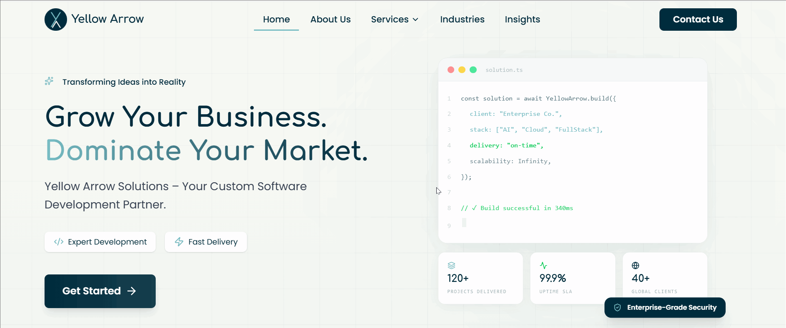

# 👋 Hi, I'm Soumojit Ghosh

### Full Stack Developer | React • Next.js • Node.js • React Native • Flutter

[ADD YOUR TAGLINE HERE]

---

## 🚀 About Me

Full Stack Developer specializing in building scalable web and mobile applications. Experienced in developing modern web platforms, CRM systems, e-commerce solutions, and AI-powered automation tools. Passionate about creating clean, efficient, and user-friendly applications using cutting-edge technologies.

All the projects listed below have been handled end-to-end by me — from design and development to deployment.

---

<table>
<tr>
<td width="50%">

#### ARCTIQ Foods & Beverages

Corporate website for food and beverage company with product catalogs and ordering system.

🔒 **Private Repository**
[Live Demo](https://arctiqfoods.com/) | 

**Account:** `soumojitg-spec`

</td>
<td width="50%">

#### Loan EMI Calculator

**Created:** December 2025

Financial calculator for loan EMI calculations with amortization schedules.

🔒 **Private Repository**
[Live Demo](#) | 

**Account:** `soumojitg-spec`

</td>
</tr>

<tr>
<td width="50%">

#### Agency CRM

Comprehensive CRM solution for digital agencies with client management, project tracking, and billing.

🔒 **Private Repository**
[Live Demo](#) | 

**Account:** `soumojitg-spec`

</td>
<td width="50%">

#### CRM Prototype (Full Stack)

Full-stack CRM prototype with separate frontend and backend architecture.

🔒 **Private Repository** (Frontend & Backend)
[Live Demo](#) | 

**Repos:** `crm-prototype-frontend` + `crm-prototype-backend`
**Account:** `soumojitg-spec`

</td>
</tr>

<tr>
<td width="50%">

#### Custom Theme (Liquid)

**Created:** January 2026

Custom Shopify theme built with Liquid templating for e-commerce stores.

🔒 **Private Repository**
[Live Demo](#) | 

**Account:** `this-soumojit`

</td>
<td width="50%">

#### Akara Custom Theme

**Created:** November 2025

Bespoke Shopify theme for Akara brand with custom functionality.

🔒 **Private Repository**
[Live Demo](#) | 

**Account:** `this-soumojit`

</td>
</tr>
</table>
🔒 **Private Repository**
[Live Demo](https://shakadesignlab.pages.dev/) | 

**Account:** `soumojitg-spec`

</td>
</tr>
</table>

---

### 🤖 AI & Automation

<table>
<tr>
<td width="50%">

#### AI Hiring Automation

AI-powered recruitment platform automating candidate screening, interviews, and hiring workflows.

🔒 **Private Repository**
[Live Demo](#) | 

**Account:** `soumojitg-spec`

</td>
<td width="50%">

#### HirePilot - AI Hiring Automation

**Updated:** February 2026

Advanced AI recruitment system with automated screening and candidate management.

🔒 **Private Repository**
[Live Demo](#) | 

**Account:** `this-soumojit`

</td>
</tr>

<tr>
<td width="50%">

#### LeadFlow Automation

Automated lead management and workflow automation system for sales teams.

🔒 **Private Repository**
[Live Demo](https://leadflow.growthex.cloud/) | 

**Account:** `soumojitg-spec`

</td>
<td width="50%">

#### DevTools

**Recently Updated**

Developer tools and utilities suite for productivity enhancement.

🔒 **Private Repository**
[Live Demo](https://devtools.codehez.com/) | 

**Account:** `this-soumojit`

</td>
</tr>
</table>

---

### 🏪 E-commerce & CRM

<table>
<tr>
<td width="50%">

#### Agency CRM

Comprehensive CRM solution for digital agencies with client management, project tracking, and billing.

🔒 **Private Repository**
[Live Demo](#) | 

**Account:** `soumojitg-spec`

</td>
<td width="50%">

#### CRM Prototype (Full Stack)

Full-stack CRM prototype with separate frontend and backend architecture.

🔒 **Private Repository** (Frontend & Backend)
[Live Demo](#) | 

**Repos:** `crm-prototype-frontend` + `crm-prototype-backend`
**Account:** `soumojitg-spec`

</td>
</tr>
<td width="50%">
#### LeadFlow Automation

Automated lead management and workflow automation system for sales teams.

🔒 **Private Repository**
[Live Demo](https://leadflow.growthex.cloud/) | 

**Account:** `soumojitg-spec`

</td>
<td width="50%">
#### DevTools

**Recently Updated**

Developer tools and utilities suite for productivity enhancement.

🔒 **Private Repository**
[Live Demo](https://devtools.codehez.com/) | 

**Account:** `this-soumojit`

</td>
</tr>

<tr>

<tr>
<td width="50%">

#### ARCTIQ Foods & Beverages

Corporate website for food and beverage company with product catalogs and ordering system.

🔒 **Private Repository**
[Live Demo](https://arctiqfoods.com/) | 

**Account:** `soumojitg-spec`

</td>
<td width="50%">

#### Loan EMI Calculator

**Created:** December 2025

Financial calculator for loan EMI calculations with amortization schedules.

🔒 **Private Repository**
[Live Demo](#) | 

**Account:** `soumojitg-spec`

</td>
</tr>
</table>

---

### 🌐 Web Platforms & Portfolios

<table>
<tr>
<td width="50%">

#### GrowthEx Root

Main platform for GrowthEx digital solutions with modern architecture.

🔒 **Private Repository**
[Live Demo](https://growthex.cloud/) | 

**Account:** `soumojitg-spec`

</td>
<td width="50%">

#### GrowthEx Cloud

Cloud-based services and solutions platform for GrowthEx.

🔒 **Private Repository**
[Live Demo](#) | 

**Account:** `soumojitg-spec`

</td>
</tr>

<tr>
<td width="50%">

#### ElevateDigi

**Created:** December 2025

Digital marketing agency website with service showcases and client portals.

🔒 **Private Repository**
[Live Demo](https://www.theelevatedigi.com/) | 

**Account:** `this-soumojit`

</td>
<td width="50%">

#### Yellow Arrow

**Created:** December 2025

Creative agency platform with portfolio showcase and client management.

🔒 **Private Repository**
[Live Demo](#) | 

**Account:** `this-soumojit`

</td>
</tr>

<tr>
<td width="50%">

#### DemoRash

**Created:** October 2025

Modern portfolio template with animations and dark mode support.

[Live Demo](#) | 

**Account:** `this-soumojit`

</td>
<td width="50%">

#### AD-Sense

**Recently Updated**

Advertisement management and analytics platform.

🔒 **Private Repository**
[Live Demo](#) | 

**Account:** `this-soumojit`

</td>
</tr>
</table>

---

## 📊 GitHub Statistics

---

## 📫 Get In Touch

**Open to freelance projects and collaboration opportunities!**

---

### 💡 "Building the future, one commit at a time"

